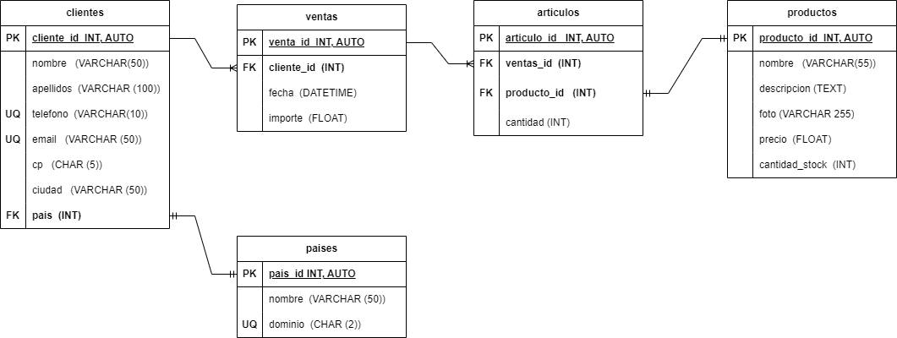

# VENTAS

## Listado de entidades y atributos

### clientes **(ED)**

- cliente_id **(PK)**
- nombre
- apellidos
- telefono **(UQ)**
- email **(UQ)**
- direccion
- cp
- ciudad
- pais **(FK)**

### productos **(ED|EC)**

- producto_id **(PK)**
- nombre
- descripcion
- foto
- precio
- cantidad_stock

### ventas

- venta_id **(PK)**
- cliente_id **(FK)**
- fecha
- importe

### articulos_x_venta **(EP)**

- articulo_id **(PK)**
- ventas_id **(FK)**
- producto_id **(FK)**
- cantidad

### paises **(EC)**

- pais_id **(PK)**
- nombre
- dominio **(UQ)**

## Relaciones

- **Un cliente** pertenece a **un país** (_1 - 1_).
- **Un cliente** genera **varias ventas** (_1 - M_).
- **Una venta** tiene **varios artículos** (_1 - M_).
- **Un artículo** es **un producto** (\_1 - 1).

## Reglas de Negocio

### clientes

- Crear un cliente
- Leer todos los clientes
- Leer un cliente
- Actualizar un cliente
- Eliminar un cliente

### productos

- Crear un producto
- Leer todos los productos
- Leer un producto en particular
- Actualizar un producto
- Eliminar un producto
- Cada vez que haya una venta, restar a la cantidad de productos disponibles (stock) el número de artículos que se vendieron

### ventas

- Crear una venta
- Leer todas las ventas
- Leer una venta en particular
- Leer todas las ventas de un cliente
- Leer todas las ventas de un producto
- Actualizar una venta
- Elminar una venta

### articulos_x_venta

- Crear un artículo
- Leer todos los artículos
- Leer un artículo en particular
- Leer todos los artículos de una venta
- Leer todos los artículos de un producto
- Leer todos los artículos de un cliente
- Actualizar un artículo
- Eliminar un artículo

### paises

- Crear un país
- Leer todos los paises
- Leer un país en particular
- Actualizar un país
- Eliminar un país
